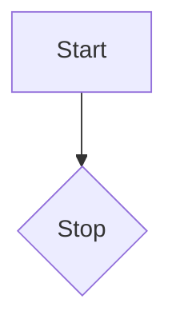

--
This is mermaid example
--

<!-- testing chore: -->
<!-- breaking change -->
<!-- update deps -->
<!-- ! breaking changes -->

<!-- docs -->
<!-- 2nd breaking change -->
<!-- BREAKING CHANGE FINAL WITH BREAKING CHANGE-->
<!-- ! breaking chnage with ! -->
change requesrt
